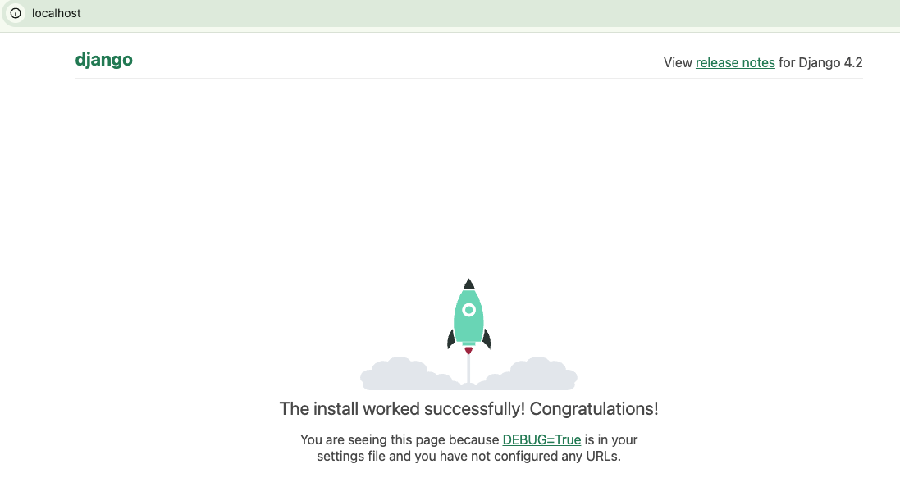
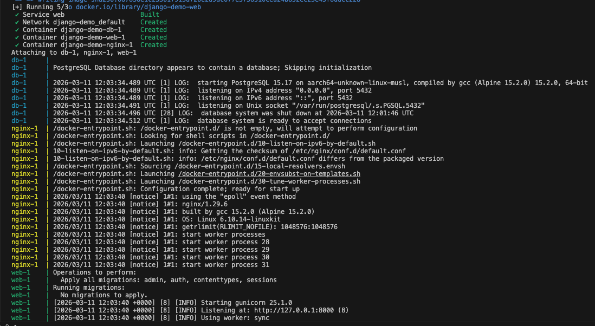

**1. Сборка Docker-образа** \
Находясь в корневой папке проекта (где расположен Dockerfile), выполните команду сборки образа и присвойте ему тег django-app:
```
docker build -t django-simple-app:v1 . 
```

**2. Запуск приложения в контейнере** \
Запустите собранный контейнер в фоновом режиме (-d). Мы пробрасываем порт 80 вашей локальной машины на порт 8000 внутри контейнера (где запущен Django):

```
docker run -d -p 80:8000 --name django-simple-container django-simple-app:v1
```

**3. Проверка результата** \
Убедиться в запуске контейнера

```
docker ps
```

Откройте браузер и перейдите по адресу:
http://localhost:80 (или http://localhost).

В результате выполнения будет отображена страница с ракетой и текст:
***
*The install worked successfully! Congratulations!
You are seeing this page because DEBUG=True is in your settings file and you have not configured any URLs.*
***



***Дополнительная информация:*** \
Содержимое директории jproject и файла manage.py были получены путём запуска команды:
```
docker run --rm -v $(pwd):/app -w /app python:3.10-slim sh -c "pip install -r requirements.txt && django-admin startproject jproject ."
```

Структура проекта:
```
django_demo/
├── Dockerfile
├── requirements.txt
├── nginx/
│   └── default.conf
├── manage.py
└── jproject/
    ├── __init__.py
    ├── asgi.py
    ├── settings.py
    ├── urls.py
    └── wsgi.py
staff/
├── django_simple.png
README.md
```

**4. Опционально:** \
Запуск приложения с использованием docker compose. \
Используется связка PostgreSQL + Django + Nginx.

```
docker compose up -d --build
```

В результате запуска получаем связку из 3х компонентов

