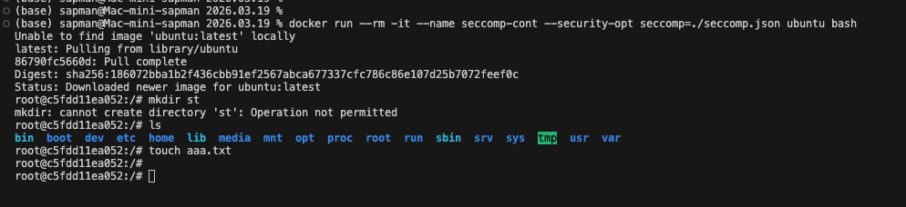

**Задача 1:**\
Создать профиль seccomp, который будет запрещать команду mkdir, но разрешать все остальные.

*Решение:*\
Консольная утилита mkdir под капотом использует системный вызов mkdirat.
Закрываем оба варианта.

Файл расположен: ./seccomp.json

*Запуск:*
```
docker run --rm -it \
  --name seccomp-cont \
  --security-opt seccomp=./seccomp.json \
  ubuntu bash
```
Проверка успешности:



**Задача 2:**

Модифицировать apparmor профиль для nginx (профиль брать тут https://docs.docker.com/engine/security/apparmor/) так, чтобы команда touch была запрещена во всей файловой системе контейнера.

*Решение:*

***Данную работу выполнял на MacOS на базе Apple Silicon. В связи с чем не было возможности проверить корректность запуска профиля. Внутри VM возникли отдельные сложности***

Добавлен блок:
```
  # -------------------------
  # Запрет на использование touch по всей файловой системе
  deny /**/touch mrwklx,
  # -------------------------
```

Возможно правильный путь:
```
  # -------------------------
  # Запрет на использование touch по всей файловой системе
  deny /bin/touch mrwklx,
  deny /usr/bin/touch mrwklx,
  # ---
```
Файл расположен: ./docker-nginx-deny-touch

1. Добавление профиля в ядро Linux

```
sudo apparmor_parser -r -W ./docker-nginx-deny-touch
```
2. Запуск: 
```
docker run --rm -it \
  --name secure-nginx \
  --security-opt apparmor=docker-nginx-deny-touch \
  -p 80:80 \
  nginx bash
```